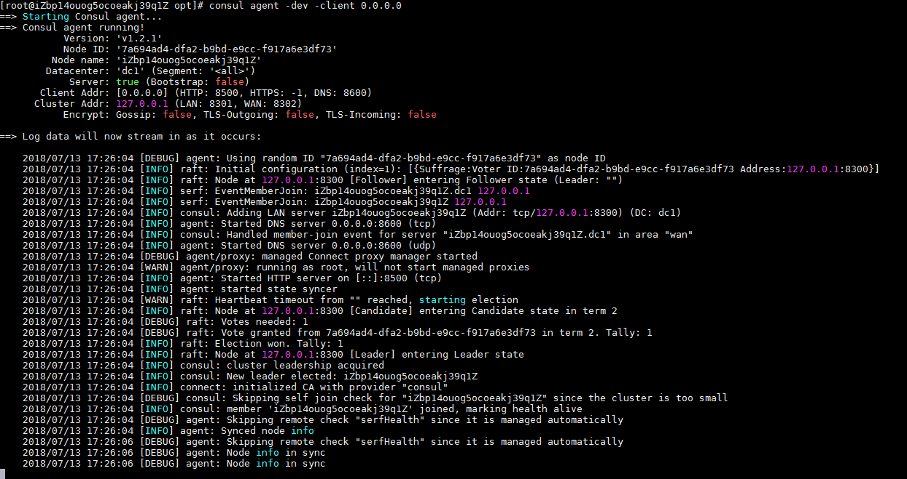
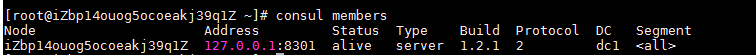
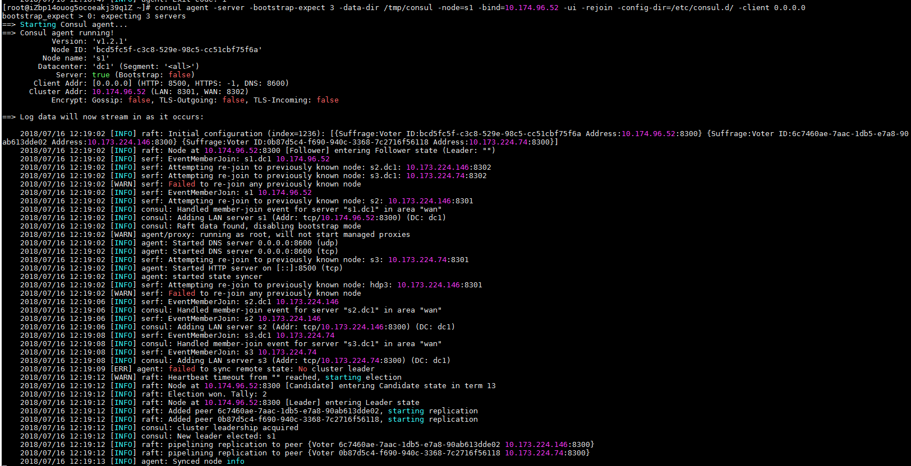
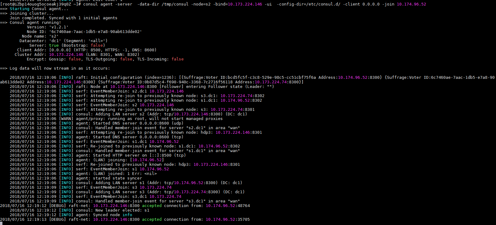
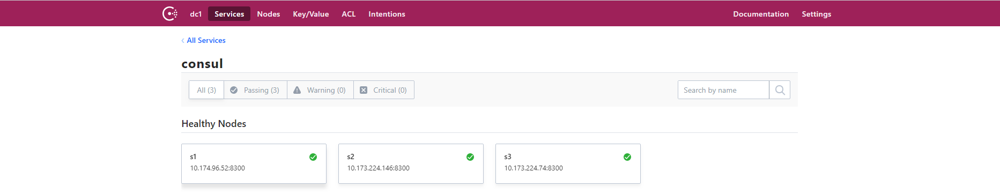
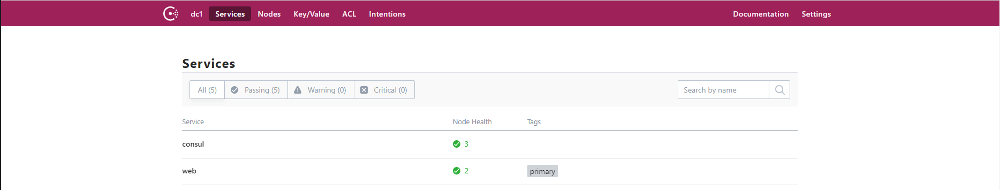
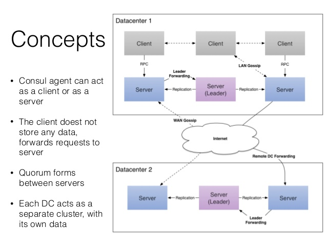

# 什么是Consul

- 是一个服务管理软件。
- 支持多数据中心下，分布式高可用的，服务发现和配置共享。
- consul支持健康检查，允许存储键值对。
- 一致性协议采用 Raft 算法,用来保证服务的高可用.
- 成员管理和消息广播 采用GOSSIP协议，支持ACL访问控制。

**ACL技术**

在路由器中被广泛采用，它是一种基于包过滤的流控制技术。控制列表通过把源地址、目的地址及端口号作为数据包检查的基本元素，并可以规定符合条件的数据包是否允许通过。

**gossip就是p2p协议。**

他主要要做的事情是，去中心化。
这个协议就是模拟人类中传播谣言的行为而来。首先要传播谣言就要有种子节点。种子节点每秒都会随机向其他节点发送自己所拥有的节点列表，以及需要传播的消息。任何新加入的节点，就在这种传播方式下很快地被全网所知道。

**什么是强一致性协议？**

按照某一顺序串行执行存储对象读写操作， 更新存储对象之后， 后续访问总是读到最新值。 假如进程A先更新了存储对象，存储系统保证后续A,B,C进程的读取操作都将返回最新值。强一致性模型有几种常见实现方法， 主从同步复制， 以及quorum复制等。

Consul is opinionated in its usage while Serf is a more flexible and general purpose tool. In CAP terms, Consul uses a CP architecture, favoring consistency over availability.

[官方文档地址](https://www.consul.io/intro/vs/serf.html)

说明consul是cp的，并不是网上有些文章说的是ca模式

下面表格对consul 、zookeeper、 etcd、 euerka做了对比

| Feature              | Consul                 | zookeeper             | etcd              | euerka                       |
| -------------------- | ---------------------- | --------------------- | ----------------- | ---------------------------- |
| 服务健康检查         | 服务状态，内存，硬盘等 | (弱)长连接，keepalive | 连接心跳          | 可配支持                     |
| 多数据中心           | 支持                   | —                     | —                 | —                            |
| kv存储服务           | 支持                   | 支持                  | 支持              | —                            |
| 一致性               | raft                   | paxos                 | raft              | —                            |
| cap                  | cp                     | cp                    | cp                | ap                           |
| 使用接口(多语言能力) | 支持http和dns          | 客户端                | http/grpc         | http（sidecar）              |
| watch支持            | 全量/支持long polling  | 支持                  | 支持 long polling | 支持 long polling/大部分增量 |
| 自身监控             | metrics                | —                     | metrics           | metrics                      |
| 安全                 | acl /https             | acl                   | https支持（弱）   | —                            |
| spring cloud集成     | 已支持                 | 已支持                | 已支持            | 已支持                       |

# Consul安装

安装Consul,找到适合你系统的包下载他.Consul打包为一个’Zip’文件.[前往下载](https://www.consul.io/downloads.html)

下载后解开压缩包.拷贝Consul到你的PATH路径中,在Unix系统中`/bin`和`/usr/local/bin`是通常的安装目录.根据你是想为单个用户安装还是给整个系统安装来选择.在Windows系统中有可以安装到`%PATH%`的路径中.

## 验证安装

完成安装后,通过打开一个新终端窗口检查`consul`安装是否成功.通过执行 `consul`你应该看到类似下面的输出

```
[root@iZbp14ouog5ocoeakj39q1Z ~]# consul
Usage: consul [--version] [--help] <command> [<args>]

Available commands are:
    agent          Runs a Consul agent
    catalog        Interact with the catalog
    connect        Interact with Consul Connect
    event          Fire a new event
    exec           Executes a command on Consul nodes
    force-leave    Forces a member of the cluster to enter the "left" state
    info           Provides debugging information for operators.
    intention      Interact with Connect service intentions
    join           Tell Consul agent to join cluster
    keygen         Generates a new encryption key
    keyring        Manages gossip layer encryption keys
    kv             Interact with the key-value store
    leave          Gracefully leaves the Consul cluster and shuts down
    lock           Execute a command holding a lock
    maint          Controls node or service maintenance mode
    members        Lists the members of a Consul cluster
    monitor        Stream logs from a Consul agent
    operator       Provides cluster-level tools for Consul operators
    reload         Triggers the agent to reload configuration files
    rtt            Estimates network round trip time between nodes
    snapshot       Saves, restores and inspects snapshots of Consul server state
    validate       Validate config files/directories
    version        Prints the Consul version
    watch          Watch for changes in Consul
```

如果你得到一个`consul not be found`的错误,你的`PATH`可能没有正确设置.请返回检查你的`consul`的安装路径是否包含在`PATH`中.

## consule参数的介绍

### consul 术语

首先介绍下在 consul 中会经常见到的术语：

- `node`：节点，需要 consul 注册发现或配置管理的服务器。在一个集群中必须是唯一的，默认是该节点的主机名
- `agent`：consul 中的核心程序，它将以守护进程的方式在各个节点运行，有 client 和 server 启动模式。每个 agent 维护一套服务和注册发现以及健康信息。
- `client`：agent 以 client 模式启动的节点。在该模式下，该节点会采集相关信息，通过 RPC 的方式向 server 发送。这个地址提供HTTP、DNS、RPC等服务，默认是127.0.0.1所以不对外提供服务，如果你要对外提供服务改成0.0.0.0
- `server`：agent 以 server 模式启动的节点。一个数据中心中至少包含 1 个 server 节点。不过官方建议使用 3 或 5 个 server 节点组建成集群，以保证高可用且不失效率。server 节点参与 Raft、维护会员信息、注册服务、健康检查等功能。
- `datacenter`：数据中心，私有的，低延迟的和高带宽的网络环境。一般的多个数据中心之间的数据是不会被复制的，但可用过 [ACL replication](https://www.consul.io/docs/guides/acl.html#outages-and-acl-replication) 或使用外部工具 [onsul-replicate](https://github.com/hashicorp/consul-replicate)。
- `Consensus`，[共识协议](https://www.consul.io/docs/internals/consensus.html)，使用它来协商选出 leader。
- `Gossip`：consul 是建立在 [Serf](https://www.serf.io/)，它提供完整的 [gossip protocol](https://www.consul.io/docs/internals/gossip.html)，[维基百科](https://en.wikipedia.org/wiki/Gossip_protocol)。
- `LAN Gossip`，Lan gossip 池，包含位于同一局域网或数据中心上的节点。
- `WAN Gossip`，只包含 server 的 WAN Gossip 池，这些服务器主要位于不同的数据中心，通常通过互联网或广域网进行通信。
- `members`：成员，对 consul 成员的称呼。提供会员资格，故障检测和事件广播。
- `-bootstrap-expect` ：在一个datacenter中期望提供的server节点数目，当该值提供的时候，consul一直等到达到指定sever数目的时候才会引导整个集群，该标记不能和bootstrap共用
- `-bind`：该地址用来在集群内部的通讯，集群内的所有节点到地址都必须是可达的，默认是0.0.0.0
- `-ui-dir`： 提供存放web ui资源的路径，该目录必须是可读的，**1.2中是直接使用-ui参数就可以**
- `-rejoin`：使consul忽略先前的离开，在再次启动后仍旧尝试加入集群中。
- `-config-dir`：：配置文件目录，里面所有以.json结尾的文件都会被加载

### consul 端口说明

consul 内使用了很多端口，理解这些端口的用处对你理解 consul 架构很有帮助：

| 端口         | 说明                                                         |
| ------------ | ------------------------------------------------------------ |
| TCP/8300     | 8300 端口用于服务器节点。客户端通过该端口 RPC 协议调用服务端节点。服务器节点之间相互调用 |
| TCP/UDP/8301 | 8301 端口用于单个数据中心所有节点之间的互相通信，即对 LAN 池信息的同步。它使得整个数据中心能够自动发现服务器地址，分布式检测节点故障，事件广播（如领导选举事件）。 |
| TCP/UDP/8302 | 8302 端口用于单个或多个数据中心之间的服务器节点的信息同步，即对 WAN 池信息的同步。它针对互联网的高延迟进行了优化，能够实现跨数据中心请求。 |
| 8500         | 8500 端口基于 HTTP 协议，用于 API 接口或 WEB UI 访问。       |
| 8600         | 8600 端口作为 DNS 服务器，它使得我们可以通过节点名查询节点信息。 |

# Consul运行

## 开发模式运行consul



- 查看集群成员

新开一个终端窗口运行`consul members`, 你可以看到Consul集群的成员.



- 浏览器查看webUI界面

  浏览器中输出serverip:8500,会出现consul的管理webUI


## 生产环境运行consul

### 启动三台server服务器

 agent可以运行为server或client模式.每个数据中心至少必须拥有一台server . 建议在一个集群中有3或者5个server.部署单一的server,在出现失败时会不可避免的造成数据丢失.

```
其他的agent运行为client模式.一个client是一个非常轻量级的进程.用于注册服务,运行健康检查和转发对server的查询.agent必须在集群中的每个主机上运行. 
```

这里启动三个agent server，三台机器的地址分别是

```
10.174.96.52    s1 
10.173.224.146  s2
10.173.224.74   s3
```

必须有一个初始节点，且手动指定为leader，然后开启其它server节点，让它们加入集群。 最后初始节点下线，重新加入集群，参与选举。

我们手动指定10.174.96.52为leader,这种方式，`-bootstrap-expect 3` 期待三个 server 加入才能完成 consul 的引导。

```
consul agent -server -bootstrap-expect 3 -data-dir /tmp/consul -node=s1 -bind=10.174.96.52 -ui -client 0.0.0.0
```

继续添加 server2、server3：

```
consul agent -server  -data-dir /tmp/consul -node=s2 -bind=10.173.224.146 -ui -join 10.174.96.52

consul agent -server  -data-dir /tmp/consul -node=s3 -bind=10.173.224.74 -ui  -join 10.174.96.52
```

- `-data-dir`：提供一个目录用来存放agent的状态，所有的agent允许都需要该目录，该目录必须是稳定的，系统重启后都继续存在
- `-join`：将agent加入到集群

**此时10.174.96.52显示的信息是，当146主机和74主机加入到集群后，s1就被选举为leader**


**10.173.224.146加入到集群中后显示的信息**：


**查看webUI**


查看三个server的名称


### 将新服务服务注册到consul

consul 支持两种服务发现的方式：

1. 通过 HTTP API 方式，这种方式需要额外编程，适用于不安装 consul agent 的情况，[文档地址](https://www.consul.io/api/catalog.html)。
2. 通过 consul agent 配置的方式，agent 启动的时候会读取一个配置文件目录，通过配置进行服务的发现，[文档地址](https://www.consul.io/docs/agent/services.html)。

这里介绍第二种方式，通过配置文件来进行服务发现。这里就需要用到我们的 client 服务器啦。

首先，用 Go 写一个简单的 HTTP 服务器：

```go
package main

import (
    "fmt"
    "net/http"
)

func HandleExample(w http.ResponseWriter, r *http.Request) {
    w.Write([]byte("hello man"))
}

func HandleHealth(w http.ResponseWriter, r *http.Request) {
    fmt.Println("health check!")
}

func main() {
    http.HandleFunc("/", HandleExample)
    http.HandleFunc("/health", HandleHealth)

    fmt.Println("listen on :9000")
    http.ListenAndServe(":9000", nil)
}
```

然后编辑一个配置文件 `/etc/consul.d/web.json`：

```json
{
    "service":
    {
        "name": "web",
        "tags": ["primary"],
        "address": "10.174.96.52",
        "port": 9000,
        "checks": [
        {
            "http": "http://localhost:9000/health",
            "interval": "10s"
        }]
    }
}
```


- `-config-dir`：配置文件目录，里面所有以.json结尾的文件都会被加载

### 配置共享

由与有了 agent client 和 server 模式的提供，配置共享也变得异常的简单。

在任意节点更新配置数据：

```
$ consul kv put redis/config 192.168.99.133
Success! Data written to: redis/config
```

整个集群均会自动更新，在 s1 节点查看数据：

```
$ consul kv get redis/config
192.168.99.133
```

## 断开连接

你可以使用`Ctrl-C` 优雅的关闭Agent. 中断Agent之后你可以看到他离开了集群并关闭.

在退出中,Consul提醒其他集群成员,这个节点离开了.如果你强行杀掉进程.集群的其他成员应该能检测到这个节点失效了.当一个成员离开,他的服务和检测也会从目录中移除.当一个成员失效了,他的健康状况被简单的标记为危险,但是不会从目录中移除.Consul会自动尝试对失效的节点进行重连.允许他从某些网络条件下恢复过来.离开的节点则不会再继续联系.

此外,如果一个agent作为一个服务器,一个优雅的离开是很重要的,可以避免引起潜在的可用性故障影响达成[一致性协议](https://www.consul.io/docs/internals/consensus.html).

查看[这里](https://www.consul.io/docs/internals/consensus.html)了解添加和移除server.

## 总结

一个consul agent就是一个独立的程序。一个长时间运行的守护进程，运行在concul集群中的每个节点上。

启动一个consul agent ，只是启动一个孤立的node，如果想知道集群中的其他节点，应该将consul agent加入到集群中去 cluster。

**agent有两种模式：server与client。**

- server模式包含了一致性的工作：保证一致性和可用性（在部分失败的情况下），响应RPC，同步数据到其他节点代理。
- client 模式用于与server进行通信，转发RPC到服务的代理agent，它仅保存自身的少量一些状态，是非常轻量化的东西。本身是相对无状态的。

agent除去设置server/client模式、数据路径之外，还最好设置node的名称和ip。

**一张经典的consul架构图片：**



- LAN gossip pool包含了同一局域网内所有节点，包括server与client。这基本上是位于同一个数据中心DC。
- WAN gossip pool一般仅包含server，将跨越多个DC数据中心，通过互联网或广域网进行通信。
- Leader服务器负责所有的RPC请求，查询并相应。所以其他服务器收到client的RPC请求时，会转发到leader服务器。

# 参考：

[consul 支持多数据中心的服务发现与配置共享工具](https://deepzz.com/post/the-consul-of-discovery-and-configure-services.html)

[consul入门](https://blog.csdn.net/viewcode/article/details/45915179)

[Consul使用手册](http://www.liangxiansen.cn/2017/04/06/consul)