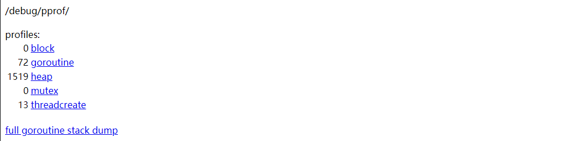
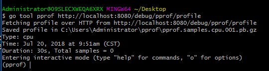
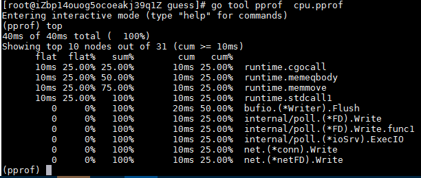
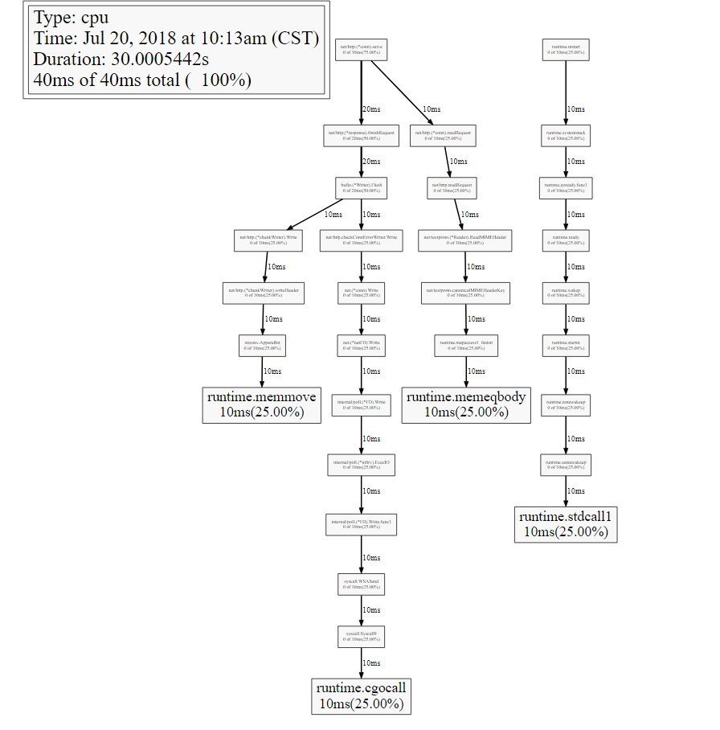
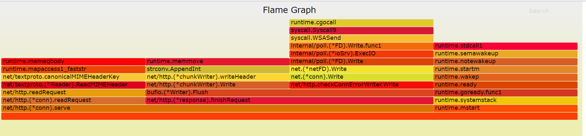

# 为什么需要性能分析

作为开发，一般在开发过程大多是为了功能的实现和单元测试，当业务量不大的时候，也不会说去过早的分析代码的性能。但是一旦业务量上来，原有开发中代码写的不太好的地方会造成性能瓶颈，这个时候就得需要性能分析工具帮助分析程序在哪块代码上出现了性能瓶颈。才可以有针对性的优化代码。

很幸运的，go语言官方有提供的性能工具pprof，我们可以很方便的分析程序运行过程中造成瓶颈的地方

# pprof

## 什么是pprof

pprof是Go语言内置的标准方法用来调试Go程序性能。golang官方有提供两种pprof启动的方式，分别是 [runtime/pprof](https://golang.org/pkg/runtime/pprof/)，[net/http/pprof](https://golang.org/pkg/net/http/pprof/) ，它能提取出来应用程序的CPU和内存数据，此外还有运行的代码行数和内容信息。

## pprof文件生成

### runtime/pprof

此包是方便不是提供web服务的后端程序来进行分析性能

```go
func main() {
	f, err := os.Create(fmt.Sprintf("cpu-%s.pprof", time.Now().Format("20060102")))
	if err != nil {
		log.Fatal("create CPU profile error: ", err)
	}
	if err := pprof.StartCPUProfile(f); err != nil {
		log.Fatal("start CPU profile error: ", err)
	}
	defer pprof.StopCPUProfile()

	go func() {
		doSth()
	}()
	//优雅退出
	sigChan := make(chan os.Signal)
	exitChan := make(chan struct{})
	signal.Notify(sigChan, os.Interrupt, syscall.SIGTERM)
	log.Printf("signal received", <-sigChan)

	go func() {
		if err := server.Stop(); err != nil {
			log.Fatal(err)
		}
		exitChan <- struct{}{}
	}()
	select {
	case <-exitChan:
	case s := <-sigChan:
		log.Panicln("signal received, stopping immediately", s)
	}
}

func doSth() {
	for {
		rand.Float32()
		time.Sleep(500 * time.Millisecond)
	}
}
```

此时运行程序会生成关于cpu统计的文件cpu-20170823.pprof

然后通过命令执行

```go
~ go tool pprof .\cpu-20170823.pprof
Type: cpu
Time: Jul 19, 2018 at 5:31pm (CST)
Duration: 58.32s, Total samples = 0
Entering interactive mode (type "help" for commands, "o" for options)
(pprof)
```

然后就可以在pprof下使用命令了

可以通过go tool pprof命令查看pprof支持哪些命令。

[runtime/pprof](https://golang.org/pkg/runtime/pprof/)的缺点是必须将程序关闭或者设置信号量来停止pprof的输出，这样才可以使用生产的pprof文件

### net/http/pprof

对专门提供web服务的程序可以使用此包，可以方便的测试应用程序的性能

要使用`net/http/pprof`包很简单，在main.go文件导入包的时候，通过`_ "net/http/pprof"`方式导入，其实看pprof.go的文件就能知道，实现的原理。

```go
func init() {
	http.HandleFunc("/debug/pprof/", Index)
	http.HandleFunc("/debug/pprof/cmdline", Cmdline)
	http.HandleFunc("/debug/pprof/profile", Profile)
	http.HandleFunc("/debug/pprof/symbol", Symbol)
	http.HandleFunc("/debug/pprof/trace", Trace)
}
```

#### 通过浏览器分析

pprof.go中最开始先申明一个init函数，这里申明了五个`HandleFunc`对应的可以在浏览器中可以打开着五个页面

`/debug/pprof/`页面是首页，可以查看go程序的堆栈、goroutine、线程等信息



一般如果要获取cpu的信息，生成pprof文件，则直接访问`/debug/pprof/profile`，

通过代码:

```go
func Profile(w http.ResponseWriter, r *http.Request) {
sec, _ := strconv.ParseInt(r.FormValue("seconds"), 10, 64)
	if sec == 0 {
		sec = 30
	}
········
	if err := pprof.StartCPUProfile(w); err != nil {
		// StartCPUProfile failed, so no writes yet.
		// Can change header back to text content
		// and send error code.
		w.Header().Set("Content-Type", "text/plain; charset=utf-8")
		w.Header().Set("X-Go-Pprof", "1")
		w.WriteHeader(http.StatusInternalServerError)
		fmt.Fprintf(w, "Could not enable CPU profiling: %s\n", err)
		return
	}
	sleep(w, time.Duration(sec)*time.Second)
	pprof.StopCPUProfile()
}
```

可以看出`Profile`函数接收一个cpu收集时间，是按秒为单位收集的，如果，不填的话，默认是30秒的收集时间.

所以想自定义程序收集cpu的时间的话就可以自己传入手机时间的数值

比如我要手机1分钟的数据，则只需要`localhost:8080/debug/pprof/profile?seconds=60`.这样的话，程序就会进入60秒的cpu收集时间，等到收集完成后，会返回一个profile的二进制文件，我们可以给重命名为`cpu.pprof`，然后就可以使用go tool pprof cpu.pprof 来进行性能分析了。

同理内存分析可以通过访问`localhost:8080/debug/pprof/heap`

#### 通过命令行来分析

可以通过命令收集cpu

`go tool pprof http://localhost:8080/debug/pprof/profile`

同样可以进行数据收集，当然，可以后面设置参数(`--seconds 25`表示设置25秒)，默认是30秒的收集时间。收集完成后悔进入pprof模式下



也可以通过命令收集内存`go tool pprof http://localhost:8080/debug/pprof/heap`

## pprof文件分析

接下来就是重点，如何分析我们pprof文件：

在进入pprof状态之后，可以使用top命令来查看，最耗费资源的是哪些函数



这里分析下各个参数的意思

### flat和cum:

Flat表示给定函数的持续时间，cum表示当前函数的累加调用。 比如有一个函数a()调用函数b()和函数c(),

函数b()耗时1秒，函数b()耗时两秒，那么cum就是1+2=3s

flat表示的是a()函数自己耗费的时间

如果a()函数是这样的

```go
b() // takes 2s
do something directly // takes 3s
c() // takes 2s
```

那么a函数的cum值是6秒，flat是3秒（假设do something directly里面没有函数调用）

### sum:

要理解sum需要看上图，第一个sum是25%和flat的25%是相同的，然后第二个sum是50%,是第一个flat的25%加上第二个flat的25%，以此类推。

具体可以参考：

[What is the meaning of “flat” and “cum” in golang pprof output](https://www.reddit.com/r/golang/comments/7ony5f/what_is_the_meaning_of_flat_and_cum_in_golang/)

### 图形分析

只是通过top命令来查看分析数据的话，太过抽象也不好分析，go tool pprof中也有工具可以把生成的pprof文件转换成图形工具，但是需要事先安装 graphviz 。

安装好之后可以直接使用命令来生成图片

```go
[root@iZbp14ouog5ocoeakj39q1Z guess]# go tool pprof  cpu.pprof
Entering interactive mode (type "help" for commands)
(pprof) svg
Generating report in profile001.svg
(pprof)
```

这样就生成了svg图片`profile001.svg`




由于我代码中并没有写太多的业务逻辑，所以这里可以看到大部分的耗时多事发生在运行时，四个耗时25%的函数是`runtime.memmove` `runtime.memeqbody` `runtimecgocall` `runtime.stdcall`.接下来，可以根据图形具体分析程序在哪里耗费资源然后进行优化

## 火焰图

上图的结构给我们的是晦涩难懂的感觉，我们需要寻求更直观，更简单的分析工具。而且使用火焰图不需要安装graphviz

go-torch是`Uber`公司开源的一款针对Go语言程序的火焰图生成工具，能收集 stack traces,并把它们整理成火焰图，直观地程序给开发人员。

go-torch是基于使用BrendanGregg创建的火焰图工具生成直观的图像，很方便地分析Go的各个方法所占用的CPU的时间， 火焰图是一个新的方法来可视化CPU的使用情况，本文中我会展示如何使用它辅助我们排查问题。

### 安装

1.首先，我们要配置`FlameGraph`的脚本

> FlameGraph 是profile数据的可视化层工具，已被广泛用于Python和Node

```shell
git clone https://github.com/brendangregg/FlameGraph.git
```

2.检出完成后，把`flamegraph.pl`拷到我们机器环境变量$PATH的路径中去，例如：

```shell
cp flamegraph.pl /usr/local/bin
```

3.在终端输入 `flamegraph.pl -h` 是否安装FlameGraph成功

```
$ flamegraph.pl -h
Option h is ambiguous (hash, height, help)
USAGE: /usr/local/bin/flamegraph.pl [options] infile > outfile.svg

    --title       # change title text
    --width       # width of image (default 1200)
    --height      # height of each frame (default 16)
    --minwidth    # omit smaller functions (default 0.1 pixels)
    --fonttype    # font type (default "Verdana")
    --fontsize    # font size (default 12)
    --countname   # count type label (default "samples")
    --nametype    # name type label (default "Function:")
    --colors      # set color palette. choices are: hot (default), mem, io,
                  # wakeup, chain, java, js, perl, red, green, blue, aqua,
                  # yellow, purple, orange
    --hash        # colors are keyed by function name hash
    --cp          # use consistent palette (palette.map)
    --reverse     # generate stack-reversed flame graph
    --inverted    # icicle graph
    --negate      # switch differential hues (blue<->red)
    --help        # this message

    eg,
    /usr/local/bin/flamegraph.pl --title="Flame Graph: malloc()" trace.txt > graph.svg
```

4.安装go-torch

有了flamegraph的支持，我们接下来要使用go-torch展示profile的输出，而安装go-torch很简单，我们使用下面的命令即可完成安装

```shell
go get -v github.com/uber/go-torch
```

5.使用go-torch -h命令：可以查看go-torch的帮助文档，这里我们根据生产的cpu.pprof文件，通过使用go-torch 命令来生成火焰图

```
$ go-torch -b cpu.pprof -f cpu.svg
INFO[12:38:16] Run pprof command: go tool pprof -raw cpu.pprof
INFO[12:38:16] Writing svg to cpu.svg
```

- **-b：**表示需要被转换成svg的二进制文件
- **-f：**表示要生成的svg图片名称

此时已经将cpu.pprof生成了cpu.svg的火焰图了，可以通过浏览器查看



这就是go-torch生成的火焰图，看起来是不是舒服多了。

> - 火焰图的y轴表示cpu调用方法的先后，比如：`bufio.(*Writer).Flush`是由`net/http.(*chunkWriter).write`和`net/http.CheckConnErrorWriter.Writer`两个函数组成的。
> - x轴表示在每个采样调用时间内，方法所占的时间百分比，越宽代表占据cpu时间越多

有了火焰图，我们就可以更清楚的看到哪个方法调用耗时长了，然后不断的修正代码，重新采样，不断优化。

# 参考：

[Go代码调优利器-火焰图](http://lihaoquan.me/2017/1/1/Profiling-and-Optimizing-Go-using-go-torch.html)

[Golang性能调优(go-torch, go tool pprof)](https://blog.csdn.net/WaltonWang/article/details/54019891)
