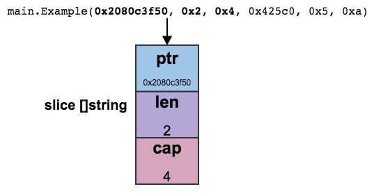
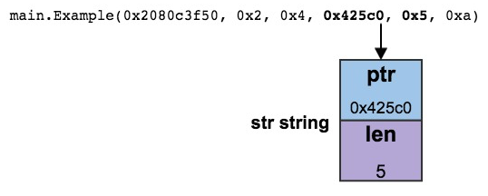

转载翻译，原文地址：[Stack Traces In Go](https://www.ardanlabs.com/blog/2015/01/stack-traces-in-go.html)

# Go里面的堆栈跟踪

在Go语言中有一些调试技巧能帮助我们快速找到问题，有时候你想尽可能多的记录异常但仍觉得不够，搞清楚堆栈的意义有助于定位Bug或者记录更完整的信息。

本文将讨论堆栈跟踪信息以及如何在堆栈中识别函数所传递的参数。

## Functions (函数的情况)

先从这段代码开始：

### 清单1

```go
 package main

 func main() {
    slice := make([]string, 2, 4)
    Example(slice, "hello", 10)
 }

 func Example(slice []string, str string, i int) {
    panic("Want stack trace")
 }
```

**清单1**显示了一个程序，其中main函数在第05行调用Example函数.Example函数在第08行声明并接受三个参数，1个string类型的slice, 1个string和1个integer, 。 Example执行的唯一代码是调用第09行的内置函数panic，它会立即生成堆栈跟踪：

### 清单2

```
Panic: Want stack trace

goroutine 1 [running]:
main.Example(0x2080c3f50, 0x2, 0x4, 0x425c0, 0x5, 0xa)
        /Users/bill/Spaces/Go/Projects/src/github.com/goinaction/code/
        temp/main.go:9 +0x64
main.main()
        /Users/bill/Spaces/Go/Projects/src/github.com/goinaction/code/
        temp/main.go:5 +0x85

goroutine 2 [runnable]:
runtime.forcegchelper()
        /Users/bill/go/src/runtime/proc.go:90
runtime.goexit()
        /Users/bill/go/src/runtime/asm_amd64.s:2232 +0x1

goroutine 3 [runnable]:
runtime.bgsweep()
        /Users/bill/go/src/runtime/mgc0.go:82
runtime.goexit()
        /Users/bill/go/src/runtime/asm_amd64.s:2232 +0x1
```

**清单2**中的堆栈跟踪显示了panic是存在的所有goroutine,每个程序的状态以及相应goroutine下的调用堆栈。

正在运行的goroutine和导致堆栈跟踪的goroutine将位于顶部。让我们关注报了panic的goroutine.

### 清单3

```
01 goroutine 1 [running]:
02 main.Example(0x2080c3f50, 0x2, 0x4, 0x425c0, 0x5, 0xa)
           /Users/bill/Spaces/Go/Projects/src/github.com/goinaction/code/
           temp/main.go:9 +0x64
03 main.main()
           /Users/bill/Spaces/Go/Projects/src/github.com/goinaction/code/
           temp/main.go:5 +0x85
```

清单三中地 01 行的的堆栈跟踪显示goroutine 1 在panic之前运行，在第 02 行，我们看到panic的代码在package main中的Example函数中。缩进的行显示了次函数所在的代码文件和路径以及正在执行的代码行。在这种情况下，第 09 行的代码正在运行，这是对panic的调用。

第 03 行显示调用Example的函数的名称，这是main包中的主要功能，在函数名称下面，缩进的行显示了对Example进行调用的代码文件的路径和代码行

堆栈工资显示goroutine范围内的函数调用链，直到发生panic发生，现在让我们关注传递给Example函数的每个参数的值：

### 清单4

```
// Declaration
main.Example(slice []string, str string, i int)

// Call to Example by main.
slice := make([]string, 2, 4)
Example(slice, "hello", 10)

// Stack trace
main.Example(0x2080c3f50, 0x2, 0x4, 0x425c0, 0x5, 0xa)
```

**清单4** 这里展示了在main中带参数调用Example函数时的堆栈信息 。 将堆栈跟踪中的值与函数声明进行比较时，它似乎不匹配。 Example函数的声明接受三个参数，但堆栈跟踪显示六个十六进制值。 要理解值如何与参数匹配的关键需要知道每个参数类型的实现。

让我们从第一个参数开始，它是一个1个string类型的slice， slice是Go中的引用类型。 这意味着slice的值是一个标题值，其中包含指向某些基础数据的指针。 在slice的情况下，标头值是三字结构，其包含指向底层阵列的指针，slice的长度和容量。 与切片标头关联的值由堆栈跟踪中的前三个值表示：

### 清单5

```
// Slice parameter value
slice := make([]string, 2, 4)

// Slice header values
Pointer:  0x2080c3f50
Length:   0x2
Capacity: 0x4

// Declaration
main.Example(slice []string, str string, i int)

// Stack trace
main.Example(0x2080c3f50, 0x2, 0x4, 0x425c0, 0x5, 0xa)
```

**清单5** 显示了堆栈跟踪中的前三个值如何与slice参数匹配。 第一个值表示指向底层字符串数组的指针。 用于初始化slice的长度和容量的数字与第二个和第三个值匹配 。这三个值表示切片标头的每个值，即Example函数的第一个参数。

**Figure 1**



现在让我们看一下第二个参数，它是一个string。 string也是引用类型，但此标头值是不可变的。 字符串的标头值被声明为两部分，包含指向底层字节数组的指针和字符串的长度：

### 清单6

```
// String parameter value
"hello"

// String header values
Pointer: 0x425c0
Length:  0x5

// Declaration
main.Example(slice []string, str string, i int)

// Stack trace
main.Example(0x2080c3f50, 0x2, 0x4, 0x425c0, 0x5, 0xa)
```

**清单6**显示了堆栈跟踪中的第四个和第五个值如何与string参数匹配。 第四个值表示指向底层字节数组的指针，第五个值表示字符串的长度为5。字符串

“hello”

需要5个字节。 这两个值表示字符串标题的每个值，即Example函数的第二个参数。

**Figure 2**



第三个参数是一个整数，它是一个单值：

### 清单7

```
// Integer parameter value
10

// Integer value
Base 16: 0xa

// Declaration
main.Example(slice []string, str string, i int)

// Stack trace
main.Example(0x2080c3f50, 0x2, 0x4, 0x425c0, 0x5, 0xa)
```

**清单7**显示了堆栈跟踪中的最后一个值如何与int类型的参数匹配。 trace中的最后一个值是十六进制数0xa，它的值是10.与该参数传递的值相同。 该值代表Example函数中的第三个参数。

**Figure 3**


## Methods(方法的情况)

如果我们将Example作为结构体的方法会怎么样呢?

### 清单8

```go
01 package main
02
03 import "fmt"
04
05 type trace struct{}
06
07 func main() {
08     slice := make([]string, 2, 4)
09
10     var t trace
11     t.Example(slice, "hello", 10)
12 }
13
14 func (t *trace) Example(slice []string, str string, i int) {
15     fmt.Printf("Receiver Address: %p\n", t)
16     panic("Want stack trace")
17 }
```

**清单8**通过在第05行声明一个名为trace的新类型，并更改程序，将Example申明为trace类型的方法。通过使用trace类型的指针接收器重新声明该函数来完成转换。 然后在第10行，将变量t申明为trace类型，并且在第11行进行方法调用。

由于该方法是使用指针声明的，因此Go将获取变量t的地址来支持接收者类型，即使方法调用是使用值来完成的。 这次运行程序时，堆栈跟踪有点不同：

### 清单9

```
Receiver Address: 0x1553a8
panic: Want stack trace

01 goroutine 1 [running]:
02 main.(*trace).Example(0x1553a8, 0x2081b7f50, 0x2, 0x4, 0xdc1d0, 0x5, 0xa)
           /Users/bill/Spaces/Go/Projects/src/github.com/goinaction/code/
           temp/main.go:16 +0x116

03 main.main()
           /Users/bill/Spaces/Go/Projects/src/github.com/goinaction/code/
           temp/main.go:11 +0xae
```

在**清单9**中你应该注意的第一件事是第02行的堆栈跟踪清楚的显示这是一个使用指针接收器调用的方法。现在函数的名称显示的样子是： 在package名字和方法名之间多出了”*trace”字样 。 需要注意的第二件事是参数列表的第1个参数标明了结构体(t)地址。 我们从堆栈跟踪中看到了这个实现细节。

## Packing（打包）

如果有多个参数可以填充到一个single word, 那么堆栈跟踪中参数的值将打包在一起 ：

### 清单10

```go
01 package main
02
03 func main() {
04     Example(true, false, true, 25)
05 }
06 
07 func Example(b1, b2, b3 bool, i uint8) {
08     panic("Want stack trace")
09 }
```

这个例子修改Example函数改为接收4个参数：3个bool型和1个八位无符号整型。bool值也是用8个bit表示，所以在32位和64位架构下，4个参数可以合并为一个single word。 当程序运行时，它会产生一个有趣的堆栈跟踪 :

### 清单11

```
01 goroutine 1 [running]:
02 main.Example(0x19010001)
           /Users/bill/Spaces/Go/Projects/src/github.com/goinaction/code/
           temp/main.go:8 +0x64
03 main.main()
           /Users/bill/Spaces/Go/Projects/src/github.com/goinaction/code/
           temp/main.go:4 +0x32
```

对于对Example的调用，堆栈跟踪中没有四个值，而是有一个值。所有四个单独的8位值都拼凑成一个单词：

```
// Parameter values
true, false, true, 25

// Word value
Bits    Binary      Hex   Value
00-07   0000 0001   01    true
08-15   0000 0000   00    false
16-23   0000 0001   01    true
24-31   0001 1001   19    25

// Declaration
main.Example(b1, b2, b3 bool, i uint8)

// Stack trace
main.Example(0x19010001)
```

**清单12**显示了堆栈跟踪中的值是如何与传入的所有四个参数值匹配.true的值是一个8位值，用1表示，false的值是0.二进制25的值是11001，转换为十六进制是19。 现在，我们看到堆栈信息中包括十六进制值，需要知道这些值是如何传递的。

# 结论

Go运行时提供了大量信息来帮助我们调试程序。在这篇文章中，我们专注于堆栈跟踪。分析在整个调用堆栈中传递给每个函数的值的能力是很有用的。它不止一次帮助我很快识别我的错误。既然您已经知道如何读取堆栈跟踪，那么希望您可以在下次发生堆栈跟踪时利用这些知识。
