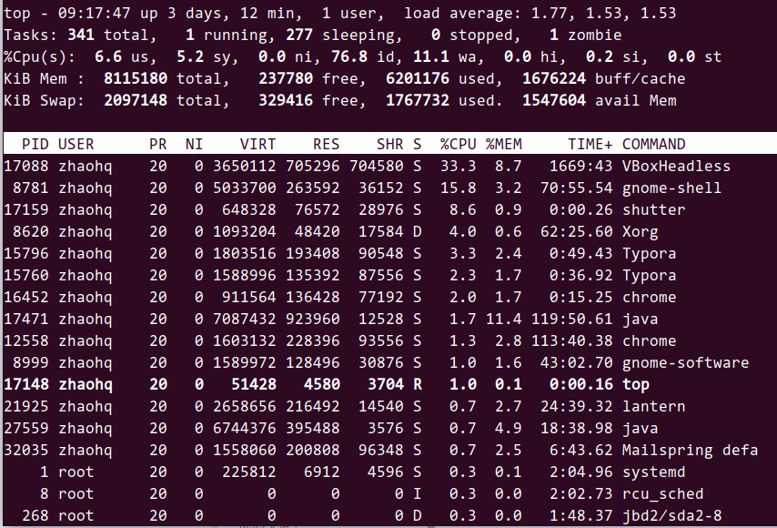
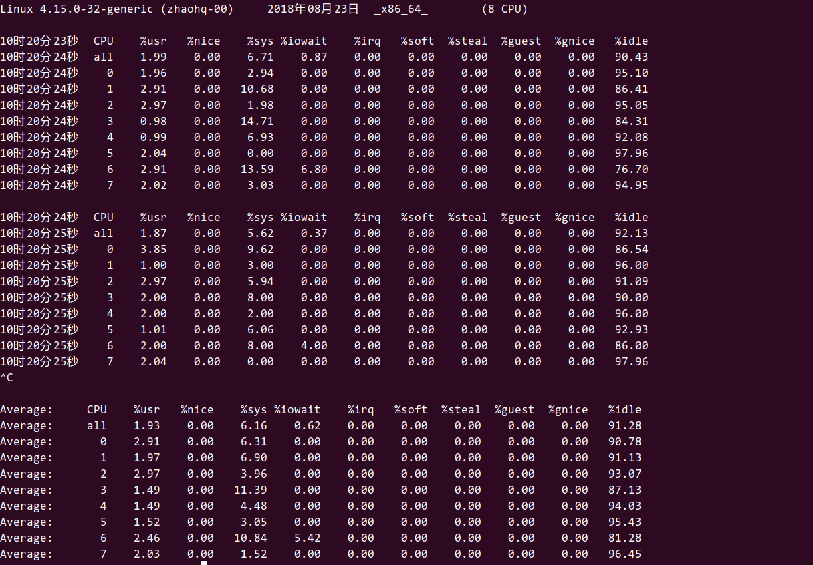

linux下性能分析工具还有很多，在平常检测系统性能的时候主要关注的无非是cpu,内存，磁盘io,网络带宽等。

# top命令

top命令工可以查看的状态就比较多了，他可以查看cpu，内存，平均负载，磁盘io等状况，使用也很简单，直接在命令行输入top。但是top对资源占用比较高，少用



top的 -b 选项开启批处理模式，将每次刷新全部打印到stdout

top的 -n 选项指定退出top命令前刷新多少次信息。

top命令的输出：

**第1行：主要关注最后三列就是系统的平均负载：**
       即系统1分钟、5分钟、15分钟内的平均负载，判断一个系统负载是否偏高需要计算单核CPU的平均负载，这里显示的系统平均负载 / CPU核数，一般以0.7为比较合适的值。偏高说明有比较多的进程在等待使用CPU资源。         
       如果1分钟平均负载很高，而15分钟平均负载很低，说明服务器正在命令高负载情况，需要进一步排查CPU资源都消耗在了哪里。反之，如果15分钟平均负载很高，1分钟平均负载较低，则有可能是CPU资源紧张时刻已经过去。

其他查看平均负载的命令还有

- tload: 能够绘制出负载变化的图形
- uptime:显示平均负载的同时，还显示开机以来的时间，和top的第一行一样，如果想要持续观察平均负载，可以使用watch uptime,默认刷新时间是两秒
- w: 显示uptime的信息以外，还同时显示已登录的用户

**第3行：当前的CPU运行情况：**

- us：非nice用户进程占用CPU的比率

- sy：内核、内核进程占用CPU的比率；

- ni：如果一些用户进程修改过优先级，这里显示这些进程占用CPU时间的比率；

- id：CPU空闲比率，如果系统缓慢而这个值很高，说明系统慢的原因不是CPU负载高；

- wa：CPU等待执行I/O操作的时间比率，该指标可以用来排查磁盘I/O的问题，通常结合wa和id判断

- hi：CPU处理硬件终端所占时间的比率；

- si：CPU处理软件终端所占时间的比率；

- st：流逝的时间，虚拟机中的其他任务所占CPU时间的比率；


　　用户进程占比高，wa低，说明系统缓慢的原因在于进程占用大量CPU，通常还会伴有教低的id，说明CPU空转时间很少；

　　wa低，id高，可以排除CPU资源瓶颈的可能。　　

　　wa高，说明I/O占用了大量的CPU时间，需要检查交换空间的使用，交换空间位于磁盘上，性能远低于内存，当内存耗尽开始使用交换空间时，将会给性能带来严重影响，所以对于性能要求较高的服务器，一般建议关闭交换空间。另一方面，如果内存充足，但wa很高，说明需要检查哪个进程占用了大量的I/O资源。

# mpstat

该命令可以显示每个CPU的占用情况，如果有一个CPU占用率特别高，那么有可能是一个单线程应用程序引起的。

mpstat  -P ALL 1

```
mpstat [-P {|ALL}] [internal [count]]
-P {|ALL} 表示监控哪个CPU， cpu在[0,cpu个数-1]中取值
internal 相邻的两次采样的间隔时间、
count 采样的次数，count只能和delay一起使用
当没有参数时，mpstat则显示系统启动以后所有信息的平均值。有interval时，第一行的信息自系统启动以来的平均信息。从第二行开始，输出为前一个interval时间段的平均信息。
```




字段的含义如下:

```
%user      在internal时间段里，用户态的CPU时间(%)，不包含nice值为负进程  (usr/total)*100
%nice      在internal时间段里，nice值为负进程的CPU时间(%)   (nice/total)*100
%sys       在internal时间段里，内核时间(%)       (system/total)*100
%iowait    在internal时间段里，硬盘IO等待时间(%) (iowait/total)*100
%irq       在internal时间段里，硬中断时间(%)     (irq/total)*100
%soft      在internal时间段里，软中断时间(%)     (softirq/total)*100
%idle      在internal时间段里，CPU除去等待磁盘IO操作外的因为任何原因而空闲的时间闲置时间(%) (idle/total)*100
```

计算公式如下

```
total_cur=user+system+nice+idle+iowait+irq+softirq
total_pre=pre_user+ pre_system+ pre_nice+ pre_idle+ pre_iowait+ pre_irq+ pre_softirq
user=user_cur – user_pre
total=total_cur-total_pre
其中_cur 表示当前值，_pre表示interval时间前的值。上表中的所有值可取到两位小数点。   
```


