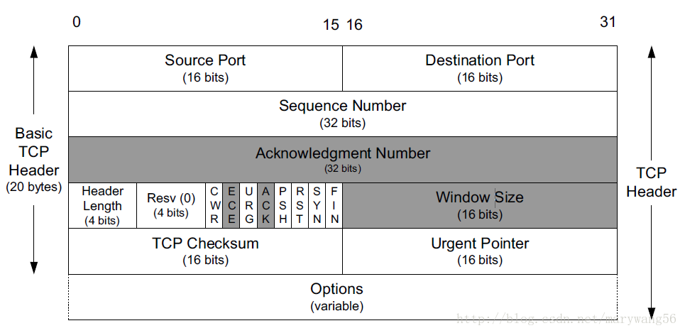
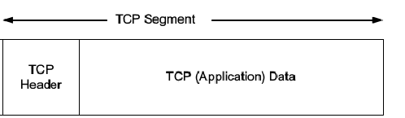
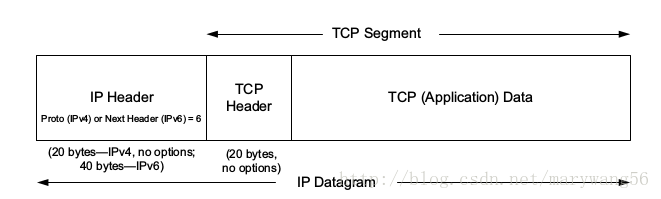

# 简介

传输控制协议中的TCP三次握手（也称为TCP握手;三次消息握手或SYN-SYN-ACK）是TCP在基于互联网协议的网络上建立TCP / IP连接所使用的方法。 TCP的三路握手技术通常被称为“SYN-SYN-ACK”（或者更准确地说是SYN，SYN-ACK，ACK），因为TCP传输三条消息来协商和启动两台计算机之间的TCP会话。 TCP握手机制被设计为使得两个尝试通信的计算机可以在传输诸如SSH和HTTP web浏览器请求之类的数据之前协商网络TCP套接字连接的参数。

此三次握手过程的设计也是为了使两端可以同时启动和协商单独的TCP套接字连接。能够同时在两个方向上协商多个TCP套接字连接允许多路复用单个物理网络接口（例如以太网）以同时传输多个TCP数据流。

## tcp帧格式

tcp数据包的格式如下：

源端口号和目的端口号与udp中类似，用于寻找发端和收端应用进程

　　**源端口号(Source Port)和目的端口号(Destination port)**与udp中类似，用于寻找发端和收端应用进程。这两个值加上IP首部中的源端IP地址和目的端IP地址唯一确定一个TCP连接，在网络编程中，一般一个IP地址和一个端口号组合称为一个套接字（socket）。 **（源端口和目的端口各占2个字节，总共四个字节）**
　　**序列号（SequenceNumber）**：32位的序列号标识了TCP报文中第一个byte在对应方向的传输中对应的字节序号。当SYN出现，SN=ISN(随机值）单位是byte。比如发送端发送的一个TCP包净荷(不包含TCP头20byte)为12byte，SN为5，则发送端接着发送的下一个数据包的时候，SN应该设置为5+12=17。通过序列号，TCP接收端可以识别出重复接收到的TCP包，从而丢弃重复包，同时对于乱序数据包也可以依靠系列号进行重排序，进而对高层提供有序的数据流。另外如果接收的包中包含SYN或FIN标志位，逻辑上也占用1个byte，应答号需加1。  **（四字节）**
　　**确认序号(Acknowledgment Number简称ACK Number)**：32位的ACK Number标识了报文发送端期望接收的字节序列。如果设置了ACK控制位，这个值表示一个准备接收的包的序列码，注意是准备接收的包，比如当前接收端接收到一个净荷为12byte的数据包，SN为5，则会回复一个确认收到的数据包，如果这个数据包之前的数据也都已经收到了，这个数据包中的ACK Number则设置为12+5=17，表示之前的数据都已经收到了，准备接受SN=17的数据包。 **（四字节）**
　

   **头长(Header Length)**：4位包括TCP头大小，指示TCP头的长度，即数据从何处开始。

​        **CWR(Congestion Window Reduce)**：拥塞窗口减少标志set by sender，用来表明它接收到了设置ECE标志的TCP包。并且sender 在收到消息之后已经通过降低发送窗口的大小来降低发送速率。

​       **ECE(ECN Echo)**：ECN响应标志被用来在TCP3次握手时表明一个TCP端是具备ECN功能的。在数据传输过程中也用来表明接收到的TCP包的IP头部的ECN被设置为11。注：IP头部的ECN被设置为11表明网络线路拥堵。

　　**URG**： 紧急指针（ urgent pointer）有效。 **（1bit）**
　　**ACK**： 取值1代表Acknowledgment Number字段有效，这是一个确认的TCP包，取值0则不是确认包。后续文章介绍中当ACK标志位有效的时候我们称呼这个包为ACK包，使用大写的ACK称呼。
　　**PSH**： 该标志置位时，一般是表示发送端缓存中已经没有待发送的数据，接收端不将该数据进行队列处理，而是尽可能快将数据转由应用处理。在处理 telnet 或 rlogin 等交互模式的连接时，该标志总是置位的。
　　**RST**： 重建连接。用于reset相应的TCP连接。通常在发生异常或者错误的时候会触发复位TCP连接。 
　　**SYN**： 同步序列编号(Synchronize Sequence Numbers)有效。该标志仅在三次握手建立TCP连接时有效。）
　　**FIN**： 发端完成发送任务。 No more data from sender。当FIN标志有效的时候我们称呼这个包为FIN包。
　　**窗口大小**：16位，该值指示了从Ack Number开始还愿意接收多少byte的数据量，也即用来表示当前接收端的接收窗还有多少剩余空间，用于TCP的流量控制。
　　**检验和**：检16位TCP头。发送端基于数据内容计算一个数值，接收端要与发送端数值结果完全一样，才能证明数据的有效性。接收端checksum校验失败的时候会直接丢掉这个数据包。CheckSum是根据伪头+TCP头+TCP数据三部分进行计算的。

**优先指针（紧急,Urgent Pointer）**：16位，指向后面是优先数据的字节，在URG标志设置了时才有效。如果URG标志没有被设置，紧急域作为填充。 

**选项(Option)**：长度不定，但长度必须以是32bits的整数倍。常见的选项包括MSS、SACK、Timestamp等等。

 

### tcp报文段

 

### ip数据报

