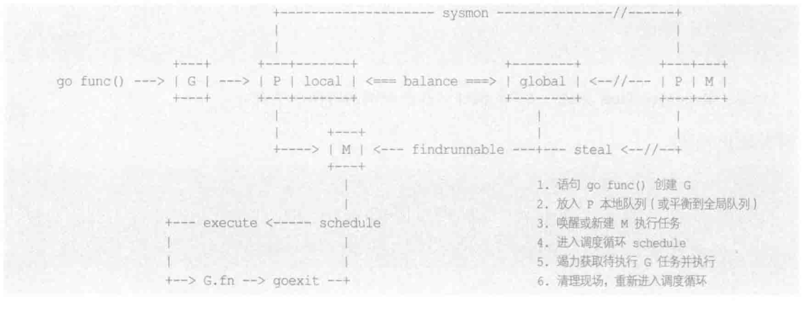
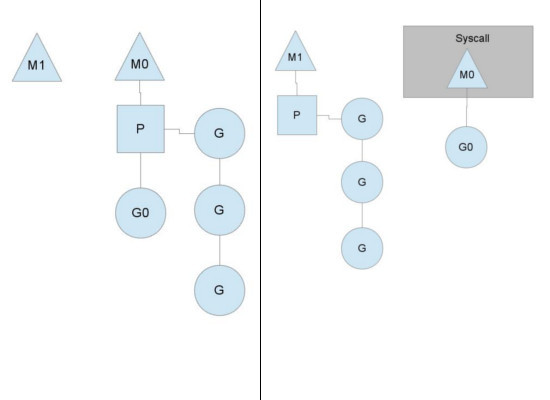

## 一、Goroutine调度器

goroutine是golang内置的协程，当我需要并发执行一些任务的时候，在go语言中可以使用go关键字来创建goroutine。

```go
go func(){
   // dosth
}()
```

相比于c++和java等语言创建线程，go语言创建的goroutine是在进程和线程的基础上做更高层次的抽象，Go采用了**用户层轻量级thread**或者说是**类coroutine**的概念来解决这些问题，Go将之称为”**goroutine**“。goroutine占用的资源非常小([Go 1.4](http://tonybai.com/2014/11/04/some-changes-in-go-1-4/)将每个goroutine stack的size默认设置为2k)，goroutine调度的切换也不用陷入(trap)操作系统内核层完成，代价很低。因此，一个Go程序中可以创建成千上万个并发的goroutine。所有的Go代码都在goroutine中执行，哪怕是go的runtime也不例外。将这些goroutines按照一定算法放到“*CPU*”上执行的程序就称为**goroutine调度器**或**goroutine scheduler**。


但是针对操作系统层面，操作系统是不知道goroutine的存在的，goroutine的调度全部是靠自己内部完成的，实现Go程序内goroutine之间“公平”的竞争“CPU”资源，这个任务就落到了Go runtime头上，要知道在一个Go程序中，除了用户代码，剩下的就是go runtime了。

## 二、Go调度器模型与演化过程

goroutine是通过三种基本对象互相协作(GMP)，来实现在用户空间管理和调度并发任务。

基本关系是



**此图来自雨痕的go语言学习笔记**

> 1. 首先是Processor(简称P):
>
>    ​	他的作用类似于CPU核，用来控制可同时并发执行的任务数，每个工作线程都必须绑定一个有效P才被允许执行任务。否则只能休眠。直到有空闲P时被唤醒，P还为线程提供执行资源，比如`内存分配`，`本地任务队列`等。线程独享所绑定的P资源，可以在无锁状态下执行高效操作。
>
> 2. 其次是Goroutine(简称G):
>
>    ​	进程内一切都在以goroutine方式运行，包括运行时相关的服务，以及mani.main入口函数。需要指出，G并非执行体，他仅仅保存并发任务状态，为任务执行提供所需的栈内存空间。G任务创建后被放置在P本地队列火全局队列，等待工作线程调度执行
>
> 3. 最后是系统线程machine(简称M):
>
>    ​	实际执行体是系统线程和p绑定，以调度循环方式不停执行G并发任务。M通过修改寄存器，将执行栈指向G自带的栈内存，并在此空间内分配堆栈帧，执行任务函数。当需要中途切换的时候，只要将相关寄存器值保存回G空间即可维持状态，任何M都可以据此恢复执行。线程仅负责执行。不在持有状态，这是并发任务跨线程调度，实现多路复用的根本所在。
>

虽然**P/M**构成执行组合体，但两者数量不是一一对应的。通常情况下，p的数量相对恒定，默认是cpu的核心数。但是也可以更多或者更少，可以通过`runtime.GOMAXPROCS()`函数来设置。但是**M**则是由调度器按需创建的，举例来说，当M因陷入系统调用而长时间阻塞时，p会被健康线程抢回去，去新建（或唤醒）一个去执行其他任务，这样M的数量就会增长。

**优点：**

​	因为G初始栈仅有2KB,且创建操作只是在用户空间简单的分配对象，远比要进入内核态分配线程要简单的多。

调度器让多个M进入调度循环，不停获取并执行任务，这样就可以创建成千上万个并发任务。


**疑问：**

​	其实按照上面的描述，goroutine调度队列只需要有M和g就可以了，用户呢创建goroutine，go运行时机制去创建线程来调度goroutine就可以，为什么要增加一个p来作为中间层呢？

**解析：**

​	查了资料之后，发现原来[Go 1.0正式发布](https://blog.golang.org/go-version-1-is-released)的时候确实是实现的G-M模型，并没有P的存在，但是此模型存在一系列不足，前Intel blackbelt工程师、现Google工程师[Dmitry Vyukov](https://github.com/dvyukov)在其《[Scalable Go Scheduler Design](https://docs.google.com/document/d/1TTj4T2JO42uD5ID9e89oa0sLKhJYD0Y_kqxDv3I3XMw/edit#!)》一文中指出了**G-M模型**的一个重要不足： 限制了Go并发程序的伸缩性，尤其是对那些有高吞吐或并行计算需求的服务程序。主要体现在如下几个方面：

> 1. 单一全局互斥锁(Sched.Lock)和集中状态存储的存在导致所有goroutine相关操作，比如：创建、重新调度等都要上锁；
> 2. goroutine传递问题：M经常在M之间传递”可运行”的goroutine，这导致调度延迟增大以及额外的性能损耗；
> 3. 每个M做内存缓存，导致内存占用过高，数据局部性较差；
> 4. 由于syscall调用而形成的剧烈的worker thread阻塞和解除阻塞，导致额外的性能损耗

于是Dmitry Vyukov亲自操刀改进Go scheduler，在[Go 1.1](https://golang.org/doc/go1.1)中实现了**G-P-M调度模型**和[work stealing算法](http://supertech.csail.mit.edu/papers/steal.pdf)，这个模型一直沿用至今

> - G: 表示goroutine，存储了goroutine的执行stack信息、goroutine状态以及goroutine的任务函数等；另外G对象是可以重用的。
> - P: 表示逻辑processor，P的数量决定了系统内最大可**并行**的G的数量（前提：系统的物理cpu核数>=P的数量）；P的最大作用还是其拥有的各种G对象队列、链表、一些cache和状态。
> - M: M代表着真正的执行计算资源。在绑定有效的p后，进入schedule循环；而schedule循环的机制大致是从各种队列、p的本地队列中获取G，切换到G的执行栈上并执行G的函数，调用goexit做清理工作并回到m，如此反复。M并不保留G状态，这是G可以跨M调度的基础。




- 当一个OS线程M0陷入阻塞时(一般是channel阻塞或network I/O阻塞或者system call阻塞)，P转而在OS线程M1上运行。调度器保证有足够的线程来运行所以的context P。图中的M1可能是被创建，或者从线程缓存中取出。当M0返回时，它必须尝试取得一个context P来运行goroutine，一般情况下，它会从其他的OS线程那里steal偷一个context P过来，如果没有偷到的话，它就把goroutine放在一个global runqueue里，然后自己就去睡大觉了（放入线程缓存里）。Contexts P们也会周期性的检查global runqueue，否则global runqueue上的goroutine永远无法执行

- 另一种情况是P所分配的任务G很快就执行完了（分配不均），这就导致了一个上下文P闲着没事儿干而系统却任然忙碌。但是如果global runqueue没有任务G了，那么P就不得不从其他的上下文P那里拿一些G来执行。一般来说，如果上下文P从其他的上下文P那里要偷一个任务的话，一般就‘偷’run queue的一半，这就确保了每个OS线程都能充分的使用。

 

## 三、调度器状态的查看方法

Go提供了调度器当前状态的查看方法：使用Go运行时环境变量GODEBUG。 

GODEBUG这个Go运行时环境变量很是强大，通过给其传入不同的key1=value1,key2=value2… 组合，Go的runtime会输出不同的调试信息，比如在这里我们给GODEBUG传入了”schedtrace=1000″，其含义就是每1000ms，打印输出一次goroutine scheduler的状态，每次一行。每一行各字段含义如下：

> SCHED 6016ms: gomaxprocs=4 idleprocs=0 threads=26 spinningthreads=0 idlethreads=20 runqueue=1 [3 4 0 10] 
>
> 
>
> SCHED：调试信息输出标志字符串，代表本行是goroutine scheduler的输出；
>
>  6016ms：即从程序启动到输出这行日志的时间； 
>
> gomaxprocs: P的数量；
>
>  idleprocs: 处于idle状态的P的数量；通过gomaxprocs和idleprocs的差值，我们就可知道执行go代码的P的数量； 
>
> threads: os threads的数量，包含scheduler使用的m数量，加上runtime自用的类似sysmon这样的thread的数量； 
>
> spinningthreads: 处于自旋状态的os thread数量； 
>
> idlethread: 处于idle状态的os thread的数量；
>
>  runqueue=1： go scheduler全局队列中G的数量；
>
>  [3 4 0 10]: 分别为4个P的local queue中的G的数量。 

 

#  参考

[也谈goroutine调度器](https://tonybai.com/2017/06/23/an-intro-about-goroutine-scheduler/)

Go语言学习笔记
[Golang 的 goroutine 是如何实现的？](https://www.zhihu.com/question/20862617)


