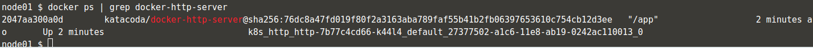
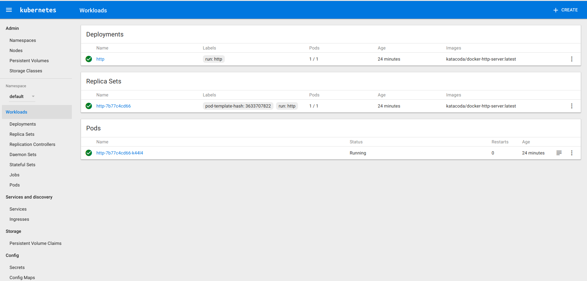

#### 第1步 - 初始化Master

Kubeadm已安装在节点上。软件包适用于Ubuntu 16.04 +，CentOS 7或HypriotOS v1.0.1 +。初始化集群的第一个阶段是启动主节点。主服务器负责运行控制平面组件，etcd和API服务器。客户端将与API通信以调度工作负载并管理群集的状态。

##### 任务

 下面的命令将使用已知token初始化集群，以简化以下步骤

```shell
categories: rediskubeadm init --token=102952.1a7dd4cc8d1f4cc5 --kubernetes-version $(kubeadm version -o short)
```

在生产中，建议排除token，导致kubeadm代表您生成一个令牌。

 要管理Kubernetes集群，需要客户端配置和证书。当kubeadm初始化集群时，将创建此配置。该命令将配置复制到用户主目录，并设置环境变量以供CLI使用。

```shell
sudo cp /etc/kubernetes/admin.conf $HOME/
sudo chown $(id -u):$(id -g) $HOME/admin.conf
export KUBECONFIG=$HOME/admin.conf
```

#### Step 2 -加入集群

 Master初始化后，只要具有正确的token，其他节点就可以加入群集。例如，可以通过kubeadm令牌管理token

##### 任务

在第二个节点上，运行命令以加入提供主节点IP地址的群集。

```shell
kubeadm join --discovery-token-unsafe-skip-ca-verification --token=102952.1a7dd4cc8d1f4cc5 172.17.0.19:6443
```

这与Master初始化后提供的命令相同。

这个

```
--discovery-token-unsafe-skip-ca-verification
```

tag用于绕过Discovery Token验证。由于此token是动态生成的，因此我们无法将其包含在步骤中。在生产中，使用kubeadm init提供的Token。

#### Step 3 - 访问节点

群集现已初始化。主节点将管理集群，而我们的一个工作节点将运行我们的容器工作负载。

##### 任务

Kubernetes CLI（称为kubectl）现在可以使用该配置来访问群集。例如，以下命令将返回群集中的两个节点。

在master节点上

```shell
kubectl get nodes 
```

> master $ kubectl get nodes
> NAME      STATUS     ROLES     AGE       VERSION
> master    NotReady   master    13m       v1.10.0
> node01    NotReady   <none>    9m        v1.10.0 

**此时，节点没有准备就绪.**

这是因为尚未部署容器网络接口。这将在下一步中修复。

#### Step 4 -部署容器网络接口 (CNI)

部署容器网络接口（Deploy Container Networking Interface ）定义了不同节点及其工作负载应如何通信。有多个网络提供商可用，其中一些已列出在[这里](https://kubernetes.io/docs/concepts/cluster-administration/addons/)

##### 任务

在这种情况下，我们将使用WeaveWorks。可以在以下位置查看部署定义

```shell
cat /opt/weave-kube
```

这可以使用`kubectl apply`进行部署。

```shell
kubectl apply -f /opt/weave-kube
```

> master $ kubectl apply -f /opt/weave-kube
> serviceaccount "weave-net" created
> clusterrole.rbac.authorization.k8s.io "weave-net" created
> clusterrolebinding.rbac.authorization.k8s.io "weave-net" created
> role.rbac.authorization.k8s.io "weave-net" created
> rolebinding.rbac.authorization.k8s.io "weave-net" created
> daemonset.extensions "weave-net" created

Weave现在将作为一系列Pod部署在集群上。可以使用以下命令查看此状态

```shell
kubectl get pod -n kube-system
```

> master $ kubectl get pod -n kube-system
> NAME                             READY     STATUS    RESTARTS   AGE
> etcd-master                      1/1       Running   0          25m
> kube-apiserver-master            1/1       Running   0          25m
> kube-controller-manager-master   1/1       Running   0          25m
> kube-dns-86f4d74b45-c8q5w        3/3       Running   0          26m
> kube-proxy-kqbsf                 1/1       Running   0          26m
> kube-proxy-w44z4                 1/1       Running   0          22m
> kube-scheduler-master            1/1       Running   0          25m
> weave-net-gn4w2                  2/2       Running   0          1m
> weave-net-rm5n5                  2/2       Running   0          1m

当在你的集群上安装Weave时，请访问https://www.weave.works/docs/net/latest/kube-addon/了解详细信息。

#### Step 5 - 部署pod

现在，群集中两个节点的状态应为Ready。这意味着我们的部署可以安排和启动。 使用Kubectl，可以部署pod。始终为主服务器发出命令，每个节点仅负责执行工作负载。 下面的命令基于Docker Image katacoda / docker-http-server创建一个Pod。

> master $ kubectl get nodes
> NAME      STATUS    ROLES     AGE       VERSION
> master    Ready     master    28m       v1.10.0
> node01    Ready     <none>    24m       v1.10.0

```shell
master $ kubectl run http --image=katacoda/docker-http-server:latest --replicas=1
```

> master $ kubectl run http --image=katacoda/docker-http-server:latest --replicas=1
>
> deployment.apps "http" created

可以使用`kubectl get pod`查看Pod创建的状态 ,

> master $ kubectl get pods
> NAME                    READY     STATUS    RESTARTS   AGE
> http-7b77c4cd66-k44l4   1/1       Running   0          1m

运行后，可以看到节点上运行的Docker Container。



#### Step 6 - 部署dashboard
Kubernetes拥有基于Web的仪表板UI，可以查看Kubernetes集群。
##### 任务
使用命令部署仪表板yaml

```shell
kubectl apply -f dashboard.yaml
```

> master $ kubectl apply -f dashboard.yaml
> serviceaccount "kubernetes-dashboard" created
> clusterrolebinding.rbac.authorization.k8s.io "kubernetes-dashboard" created
> deployment.extensions "kubernetes-dashboard" created
> service "kubernetes-dashboard" created
> serviceaccount "admin-user" created
> clusterrolebinding.rbac.authorization.k8s.io "admin-user" created

仪表板部署到kube-system名称空间中。使用`kubectl get pods -n kube-system`查看部署状态。 Katacoda部署还创建了一个管理员用户，可用于根据文档登录仪表板。

> master $ kubectl get pods -n kube-system
NAME                                                  READY     STATUS    RESTARTS   AGE
etcd-master                                           1/1       Running          0          45m
kube-apiserver-master                        1/1       Running         0          45m
kube-controller-manager-master      1/1       Running         0          45m
kube-dns-86f4d74b45-c8q5w             3/3       Running         0          46m
kube-proxy-kqbsf                                  1/1       Running         0          46m
kube-proxy-w44z4                                 1/1       Running         0          42m
kube-scheduler-master                        1/1       Running         0          45m
weave-net-gn4w2                                   2/2       Running         0          21m
weave-net-rm5n5                                   2/2       Running         0          21m

可以通过以下方式找到用户的token

```shell
kubectl -n kube-system describe secret $(kubectl -n kube-system get secret | grep admin-user | awk '{print $1}')
```

部署仪表板后，它使用externalIP将服务绑定到端口8443。

这使得仪表板可以在集群外部使用，并且可以在https://2886795329-9090-cykoria01.environments.katacoda.com/上查看



使用admin-user令牌访问仪表板。 对于生产而言，建议使用kubectl代理来访问仪表板，而不是externalIP。有关详细信息，请访问https://github.com/kubernetes/dashboard。